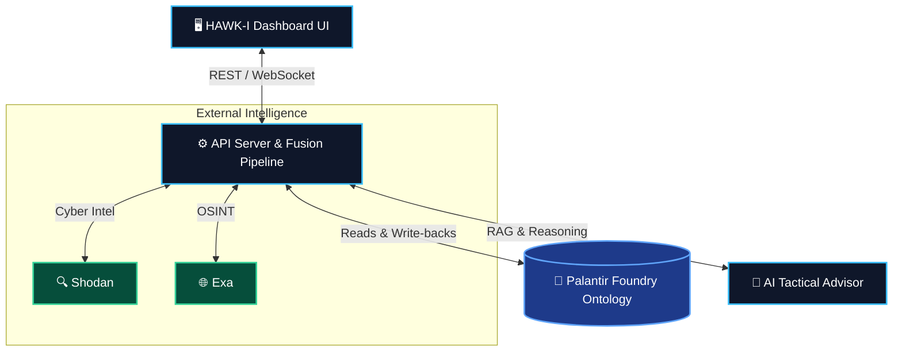

<div align="center">

# 🦅 Project HAWK-I

**Real-time Command & Control intelligence dashboard for supply chain security operations in the Red Sea and Suez Canal theater.**

[](https://www.typescriptlang.org/)
[](https://reactjs.org/)
[](https://vitejs.dev/)
[](https://nodejs.org/)
[](https://www.palantir.com/)

*Built for the National Security Hackathon*

</div>

---

> **Project HAWK-I** is a defense-tech operator console that helps analysts move from raw intelligence to a recommended Course of Action (COA) in under 60 seconds. The system fuses live Palantir Foundry ontology data, OSINT enrichment, AI reasoning, and geospatial visualization into a single battlefield-aware interface.

## 📋 Table of Contents

- [🎯 Mission Objective](#-mission-objective)
- [✨ What Makes HAWK-I Different](#-what-makes-hawk-i-different)
- [🏗️ System Architecture](#-system-architecture)
- [⚡ Core Capabilities](#-core-capabilities)
- [🔗 Palantir Foundry Integration](#-palantir-foundry-integration)
- [🌍 OSINT & External Enrichment](#-osint--external-enrichment)
- [🗺️ Geospatial Layer](#️-geospatial-layer)
- [💻 Tech Stack](#-tech-stack)
- [📁 Monorepo Structure](#-monorepo-structure)
- [🚀 Running Locally](#-running-locally)

---

## 🎯 Mission Objective

The operational problem behind HAWK-I is multi-domain disruption of maritime logistics through one of the world's most strategically important chokepoints. The platform is designed to help operators identify, correlate, and act on:

* 🛸 **Drone and missile threats**
* 🚤 **IRGC and proxy maritime harassment**
* 📡 **GPS spoofing and AIS anomalies**
* 💻 **Cyber attacks** on logistics and port systems
* 👁️ **SIGINT, ISR, and HUMINT indicators** tied to supply chain disruption

## ✨ What Makes HAWK-I Different

| Feature | Description |
| :--- | :--- |
| **Palantir-First Architecture** | Foundry serves as the core operational data fabric rather than a generic database. |
| **Bidirectional Workflow** | Reads live ontology data and writes enriched records back into Foundry datasets. |
| **Full AI Provenance** | Includes object-level references and ontology traversal context for all AI outputs. |
| **Multi-Source Fusion** | Fuses ontology data, cyber scans, OSINT enrichment, and geospatial states. |
| **Theater-Specific Design** | Tailored for Red Sea and Suez security operations, built for defense workflows. |

## 🏗️ System Architecture



## ⚡ Core Capabilities

### 🗺️ Live C2 Dashboard
- Tactical map for Red Sea and Suez operations
- Real-time threat, convoy, and escort visualization
- AI-assisted operator workflow for rapid intelligence triage
- Scripted scenario playback for live demos and mission walkthroughs

### 🤖 AI Tactical Advisor
- Embedded HAWK-I reasoning assistant for natural-language querying
- Retrieval-augmented prompt assembly using live operational context
- Long-term memory support for prior reasoning and operator context
- Response provenance for auditability and after-action review

### 🧩 Intelligence Fusion
- Ontology-driven fusion of logistics, threat, combat, and incident data
- Cyber-physical correlation through Shodan and ontology-linked IOCs
- Open-source enrichment through Exa for current reporting and context
- Cross-domain linkage across SIGINT, ISR, HUMINT, AIS, and kinetic events

## 🔗 Palantir Foundry Integration

Palantir Foundry is the centerpiece of the system. HAWK-I is built around Foundry ontology access patterns, provenance references, and dataset feedback loops.

### Ontology Coverage

HAWK-I is structured around 10 core operational object types:

| Object Type | Description |
| :--- | :--- |
| `LogisticsVessel` | Cargo vessels, tankers, and maritime logistics assets |
| `HostileThreat` | Hostile boats, drones, missile threats, and suspicious contacts |
| `CombatUnit` | US and coalition escort and force posture entities |
| `ConfirmedKineticIncident` | Verified attacks, strikes, launches, or seizures |
| `GeneratedTacticalLead` | AI-prioritized actions and operator recommendations |
| `SigintIntercept` | Intercepts, anomalies, and signals-derived intelligence |
| `IsrImagery` | ISR and imagery-backed observation records |
| `HumintReport` | Field reporting and source-driven intelligence |
| `MaritimeAisTrack` | Vessel movement and anomaly tracking |
| `CyberIoc` | Cyber indicators, infrastructure overlap, and threat tooling |

### Provenance Model

Every HAWK-I AI answer carries a strict decision trail, turning the assistant from a black box into a defense-ready system:
- Objects and Datasets consulted
- Traversal paths used during reasoning
- Referenced primary keys surfaced in the answer
- A unique provenance identifier for audit and review

## 🌍 OSINT & External Enrichment

### 🔍 Shodan
Used for cyber-physical risk enrichment:
- ICS and SCADA exposure discovery
- Maritime-adjacent internet-facing system visibility
- Correlation against known cyber indicators in the ontology

### 🌐 Exa
Supports open-source intelligence enrichment:
- Semantic search for incidents, actors, vessels, and threat reporting
- Supplemental context for evolving situations not yet represented in Foundry

## 🗺️ Geospatial Layer

The frontend combines `deck.gl` with Mapbox to render the operational picture:
- Vessel paths and convoy routes
- Threat locations and kinetic markers
- AIS anomalies and threat clustering
- Click-through workflows from map entities into intelligence context

## 💻 Tech Stack

| Layer | Technology Stack |
| :--- | :--- |
| **Frontend** | React 18, Vite, TypeScript, Tailwind CSS |
| **Backend** | Express 5, Node.js, TypeScript |
| **Monorepo** | pnpm workspaces |
| **Maps** | deck.gl, Mapbox GL |
| **AI** | OpenAI-powered RAG pipeline |
| **Auth** | OAuth2 client credentials for Palantir integrations |
| **Infra** | Replit, reverse-proxy routing, Palantir Foundry |

## 📁 Monorepo Structure

```bash
📦 Let's Begin (Project HAWK-I)
 ┣ 📂 artifacts/
 ┃ ┣ 📂 api-server/         # Express API and fusion pipeline
 ┃ ┗ 📂 c2-dashboard/       # Main operator-facing frontend
 ┣ 📂 lib/
 ┃ ┣ 📂 api-client-react/   # Generated React client
 ┃ ┣ 📂 api-spec/           # OpenAPI source
 ┃ ┣ 📂 api-zod/            # Shared API types and schemas
 ┃ ┣ 📂 db/                 # Database package
 ┃ ┗ 📂 integrations-*/     # Shared OpenAI integration packages
 ┗ 📂 scripts/              # Utility and workspace scripts
```

## 🚀 Running Locally

This repository is designed around environment-provided secrets and runtime configuration. **Do not commit `.env` files or secret material.**

### Prerequisites Variables
Create a `.env` file with the following:
```env
MAPBOX_TOKEN=your_token
SHODAN_API_KEY=your_key
EXA_API_KEY=your_key
PALANTIR_URL=your_url
PALANTIR_TOKEN=your_token # OR PALANTIR_CLIENT_ID / PALANTIR_CLIENT_SECRET
PALANTIR_ONTOLOGY_RID=your_rid
SESSION_SECRET=your_secret
DATABASE_URL=your_db_url
```

### Quick Start
Install dependencies with your workspace package manager and start the relevant apps:
```bash
# Install dependencies
pnpm install

# Start development servers
pnpm run dev
```

---

<div align="center">
  <i>Project HAWK-I demonstrates how a modern defense-tech workflow can combine ontology-native intelligence, AI reasoning, and geospatial operations into a single mission-ready console.</i>
</div>
